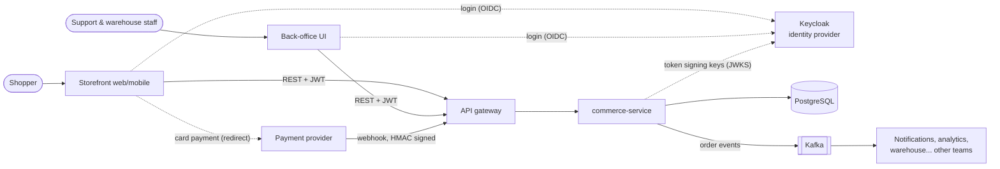
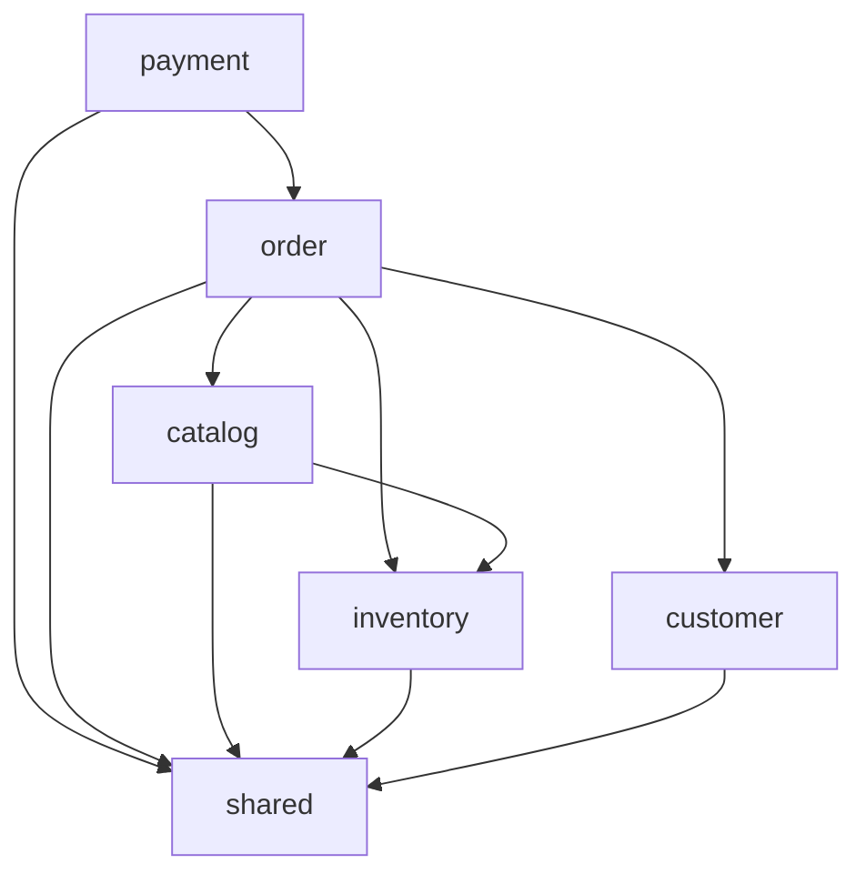
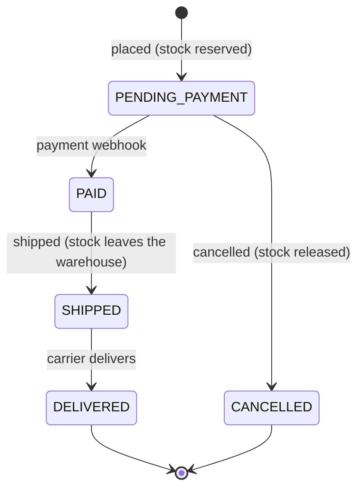
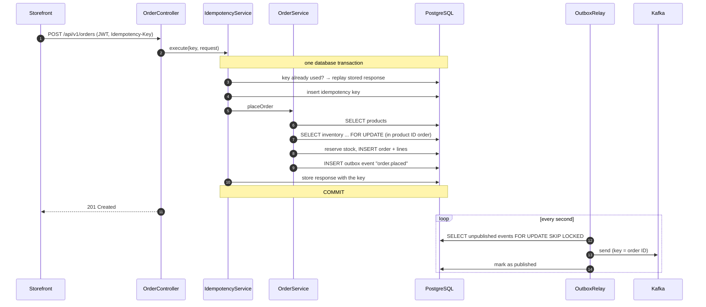
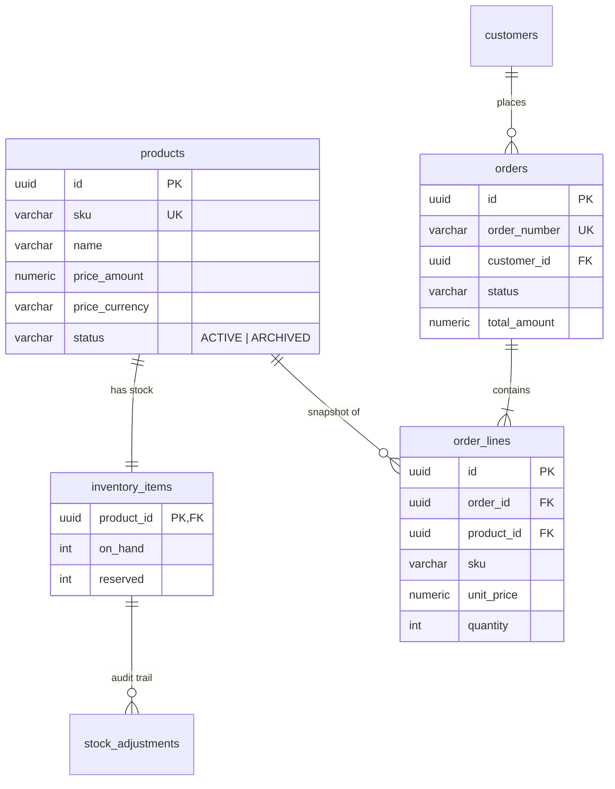

# Architecture

## Context

- **commerce-service** is the system of record for products, stock, customers and orders.
- Users authenticate with **Keycloak** (OpenID Connect). The service never sees passwords: it only validates the
  signature, issuer, audience and expiry of the JWT access tokens it receives.
- Card payments happen on the **payment provider**'s pages. The provider tells us about successful payments with a
  signed **webhook**.
- Other teams react to orders by consuming **events** from Kafka. We don't call them, and they don't call us: adding
  a new consumer requires no change in this service.

## Modules

The service is a **modular monolith** ([ADR 0002](adr/0002-modular-monolith.md)): a single deployable, organised in
business modules with explicit boundaries, checked at build time by `ArchitectureTest`.

| Module      | Responsibility                                                          | Main tables                                |
|-------------|-------------------------------------------------------------------------|--------------------------------------------|
| `catalog`   | Products, prices, search                                                | `products`                                 |
| `inventory` | Stock per product, reservations, manual adjustments with audit trail    | `inventory_items`, `stock_adjustments`     |
| `customer`  | Customer profiles, provisioned from the identity provider               | `customers`                                |
| `order`     | Order placement and lifecycle, back-office fulfilment                   | `orders`, `order_lines`                    |
| `payment`   | Payment provider webhooks                                               | `payment_webhook_events`                   |
| `shared`    | Errors, security, request IDs, idempotency, outbox, configuration       | `idempotency_keys`, `outbox_events`        |

Rules (enforced by `ArchitectureTest`):

- Each module is layered: `api` (REST) → `application` (use cases) → `domain` (entities, repositories, rules).
- A module talks to another one through its **application services**, never its repositories or controllers.
- Aggregates reference each other **by ID** (`Order.customerId`), not by JPA relationships across modules.
- No dependency cycles between modules. `shared` depends on no business module.

These rules keep the option open to extract a module into its own service one day, without paying the cost of
microservices (network calls, distributed transactions, separate deployments) today.

## Order lifecycle

The transitions are implemented by `OrderStatus#canTransitionTo` and the methods of `Order`. Any other transition is
rejected with `409 INVALID_ORDER_STATE`. Every transition publishes an event (see [events.md](events.md)).

## Placing an order

## Data model

Conventions: UUID v7 primary keys generated by the application (`Ids`), `timestamptz` columns in UTC, `version`
columns for optimistic locking on aggregates, money as `numeric(12,2)` + currency code, constraints in the database
as a last line of defence (e.g. `reserved <= on_hand`).

## Cross-cutting concerns

| Concern            | How                                                                                                   |
|--------------------|-------------------------------------------------------------------------------------------------------|
| Authentication     | JWT validated against Keycloak's keys: signature, `iss`, `aud=commerce-api`, expiry ([ADR 0006](adr/0006-jwt-resource-server.md)) |
| Authorization      | Deny by default. Routes mapped to roles in `SecurityConfig`; ownership checked in services (a customer only sees their orders) |
| Validation         | Bean Validation on request DTOs, business rules in the domain                                         |
| Errors             | RFC 9457 problem details with a stable `code`, see [api-guidelines.md](api-guidelines.md#errors)      |
| Concurrency        | Pessimistic locks for stock, optimistic locking (`@Version`) for everything else                      |
| Retries            | Idempotency keys for order creation, event IDs for webhooks, event IDs for Kafka consumers            |
| Consistency        | One transaction per use case; events through the transactional outbox ([ADR 0003](adr/0003-transactional-outbox.md)) |
| Schema             | Flyway migrations, run at startup, validated by Hibernate ([ADR 0007](adr/0007-flyway-migrations.md)) |
| Observability      | Request ID + trace ID in every log line, Prometheus metrics, OpenTelemetry traces, health probes      |
| Configuration      | 12-factor: defaults in `application.yml`, environment-specific values from environment variables      |

## Known limitations

They are deliberate simplifications for now, each tracked in the [backlog](backlog.md):

- Paid orders cannot be cancelled: refunds are not implemented.
- Unpaid orders keep their stock reserved forever if the customer never pays.
- The `idempotency_keys` and `outbox_events` tables are never purged.
- Payment failures are acknowledged but ignored.
