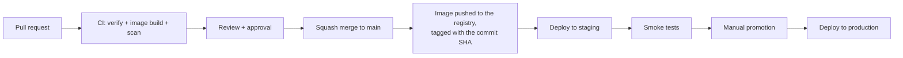

# Deployment

## Environments

| Environment  | Purpose                                      | Deployed                          | Data                     |
|--------------|----------------------------------------------|-----------------------------------|--------------------------|
| local        | Development, on your machine (`compose.yaml`) | by you                            | Demo data (seed)         |
| staging      | Integration with other teams, QA, demos       | automatically, every merge to `main` | Synthetic test data   |
| production   | Customers                                     | promotion of a version validated on staging | Real data — handle with care |

Kubernetes manifests live in [`deploy/k8s`](../deploy/k8s): a `base` and one overlay per environment (namespace,
URLs, replicas, resources). Render them locally with `kubectl kustomize deploy/k8s/overlays/staging`.

## From a commit to production

1. **CI** ([`commerce-service-ci.yml`](../../.github/workflows/commerce-service-ci.yml)) runs on every pull request:
   formatting, unit and integration tests, architecture rules, coverage gate, Docker image build and vulnerability
   scan. CodeQL scans the code for security issues.
2. After the merge, the **CD pipeline** (owned by the platform team, not in this repository) pushes the image tagged
   with the commit SHA, updates the image tag of the staging overlay (GitOps) and Argo CD rolls it out.
3. `scripts/smoke-test.sh` runs against staging.
4. Promotion to production is the same image (never rebuilt), approved by a team member.

Kubernetes performs a **rolling update**: new pods start, pass their readiness probe, receive traffic, and only then
are old pods stopped. With `maxUnavailable: 0`, capacity never drops during a deployment.

## Database migrations

Flyway applies pending migrations when the application starts, before it accepts traffic. When several replicas start
at once, Flyway's lock on the database ensures only one of them migrates.

Because old and new versions of the code run side by side during a rolling update, **every migration must be
compatible with the previous version of the code** (expand/contract, see [CONTRIBUTING.md](../../CONTRIBUTING.md)).

Long-running migrations (big backfills, index creation on large tables) must not run at startup: they would make the
startup probe fail. Discuss them with the team; they are run as a separate job.

## Rolling back

- **Code**: redeploy the previous image tag. This is safe because migrations are backward compatible.
- **Database**: we do not roll back migrations. We fix forward with a new migration.
- **Configuration**: revert the change in the overlay; the ConfigMap hash changes and pods restart.

## Graceful shutdown

On `SIGTERM` (deployment, scale-down, node maintenance) a pod:

1. keeps serving for 10 s (`preStop` hook) while the load balancers stop sending it traffic;
2. stops accepting new requests and waits up to 20 s for in-flight ones (`server.shutdown=graceful`);
3. exits. Kubernetes kills it after 45 s (`terminationGracePeriodSeconds`) if it did not.

The outbox relay may be interrupted mid-batch: unpublished events are simply published by another replica.
